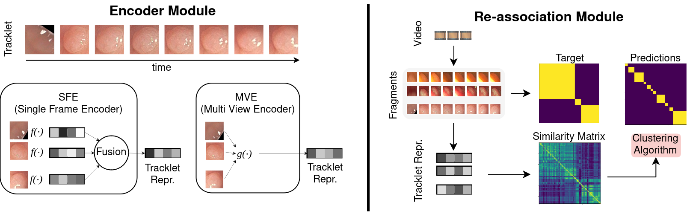

# Towards Polyp Counting in Full-Procedure Colonoscopy Videos

Luca Parolari, Andrea Cherubini, Lamberto Ballan, Carlo Biffi

> 🌟 _Under submission at ISBI 2025_

## Abstract

> Automated colonoscopy reporting holds great potential for enhancing quality control and improving cost-effectiveness of colonoscopy procedures. A key challenge for achieving this is the automated identification, tracking, and re-association (ReID) of polyps tracklets across full-procedure colonoscopy videos. This is essential for precise polyp counting and enables automated computation of key quality metrics, such as Adenoma Detection Rate (ADR) and Polyps Per Colonoscopy (PPC). However, polyp ReID is challenging due to variations in polyp appearance, frequent disappearance from the field of view, and occlusions. In this work, we leverage the REAL-Colon dataset, the first open-access dataset providing full-procedure videos, to define data splits and metrics for the problem of automatically count polyps in full-procedure videos, establishing an open-access framework. We re-implement and adapt previously proposed SimCLR based single-frame and multi-view polyp tracklet representation learning methods for the polyp counting task. We then propose an Affinity Propagation-based clustering method to further improve ReID based on these learned representations, ultimately enhancing polyp counting. Our approach achieves state-of-the-art performance, with a polyp fragmentation rate of 6.30 and a false positive rate (FPR) below 5% on the REAL-Colon dataset. We release code at https://github.com/lparolari/towards-polyp-counting.



## Data

We experiment on the open-access REAL-Colon dataset. It provides full-procedure videos and it can be downloaded for free on Figshare: https://plus.figshare.com/articles/media/REAL-colon_dataset/22202866.
(Please refer to this paper for more information: [REAL-Colon: A dataset for developing real-world AI applications in colonoscopy](https://www.nature.com/articles/s41597-024-03359-0)).

Splits proposed in the paper

| Split      | # polyps | # vids | # vids with ≥ 2 polyps | # vids per cohort | download link |
|------------|----------|--------|------------------------|-------------------|---------------|
| train      | 86       | 32     | 19                     | 6/7/8/6           | [download](data/split/instances_train.json) | 
| validation | 22       | 10     | 5                      | 2/2/3/3           | [download](data/split/instances_val.json) |
| test       | 24       | 9      | 5                      | 1/2/3/3           | [download](data/split/instances_test.json) |

## Install

* Python 3.10
* 3rd party libs

```
pip install -r requirements.txt
```

Our code uses in PyTorch 2 and Pytorch Lightning 2.

## Usage

In this repository you can find the code for the SFE ([polypsense/sfe](polypsense/sfe)) and MVE ([polypsense/mve](polypsense/mve)) models presented in the paper. The evaluation framework is implemented in ([polypsense/reid2](polypsense/reid2)).

### SFE

You can run the SFE training with 
```
python -m polypsense.sfe.cli ARGS
```
where ARGS can be seen through the `--help` option.

### MVE

You can run the MVE training with 
```
python -m polypsense.mve.cli ARGS
```
where ARGS can be seen through the `--help` option.

### Eval

You can run the eval script with 
```
python -m polypsense.reid2.fr ARGS
```
where ARGS can be seen through the `--help` option.
